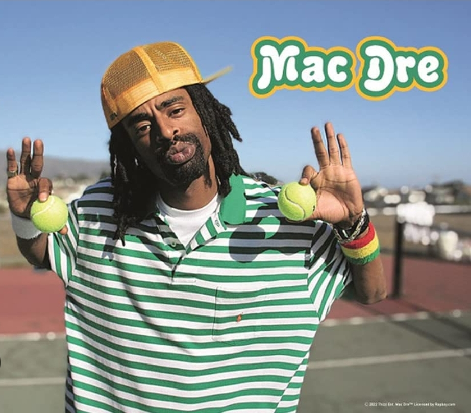
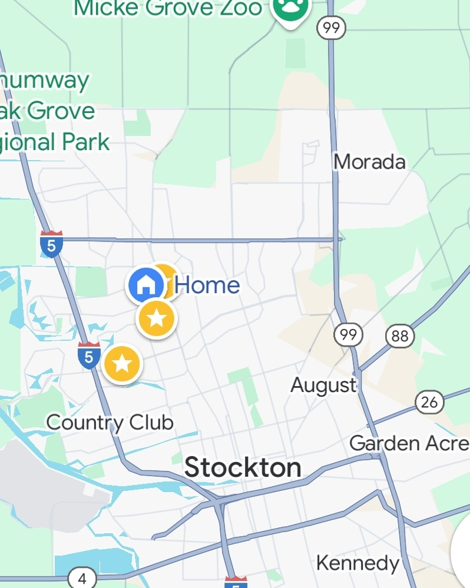
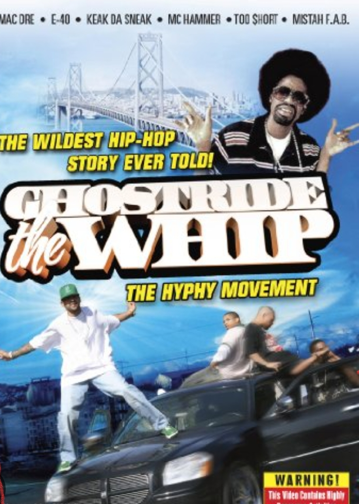

# 8500blockBWYS.github.io
What you reppin fool?
<!DOCTYPE html>
<html lang="en">
<head>
    <meta charset="UTF-8">
    <meta name="viewport" content="width=device-width, initial-scale=1.0">
    <title>8500 Block - The Hyphy Movement</title>
    <!-- Google Fonts for funky street vibe -->
    <link href="https://fonts.googleapis.com/css2?family=Bangers&family=Rock+Salt&display=swap" rel="stylesheet">
    
</head>
<body>
    <header>
        <h1>Welcome to 8500 Block</h1>
        
Reppin' the Bay Area, Stockton, and the Hyphy Movement!

    </header>

    <!-- Images -->
    
    

    <section>
        <h2>What is the Hyphy Movement?</h2>
        
The Hyphy Movement is a cultural movement that started in the Bay Area during the early 2000s. Known for its music, dance, and street culture, it was a celebration of life and freedom. Pioneered by legends like Mac Dre and Andrew Nicotina, the movement captured the spirit of Northern California.

    </section>

    <!-- YouTube Video -->
    <iframe width="560" height="315" src="https://www.youtube.com/embed/BbdpEPoN9Kw?autoplay=1&si=-q86VHxvoxQYzex2" title="YouTube video player" frameborder="0" allow="accelerometer; autoplay; clipboard-write; encrypted-media; gyroscope; picture-in-picture; web-share" referrerpolicy="strict-origin-when-cross-origin" allowfullscreen></iframe>

    <section>
        <h2>Stockton, California</h2>
        
Stockton has always been at the heart of the Hyphy Movement, with a rich culture of street life and music. It’s where we got hyper, from dancing to <strong>"Thizz"</strong> and representing the Bay Area!

        
<strong>What you reppin' fool?</strong> Thizz!

    </section>

    <!-- Ghostride the whip image -->
    

    <footer>
        
&copy; 8500Block - All rights reserved.

    </footer>
</body>
</html>
